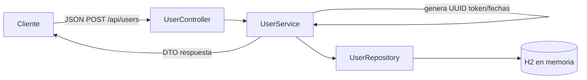

# ApiRestFull-Users
desafio tecnico BCI

API RESTful para registrar usuarios con validaciones configurables. Usa Spring Boot 3, Java 21, JPA/Hibernate y base de datos en memoria H2.

## Requisitos
- Java 21
- Gradle 8.x (`gradle` instalado).

## Cómo ejecutar
```bash
gradle bootRun
```

La API queda disponible en `http://localhost:8080`.

## Endpoint
- `POST /api/users`  
  Crea un usuario nuevo.

## Swagger/OpenAPI
- UI: `http://localhost:8080/swagger-ui.html`
- JSON: `http://localhost:8080/v3/api-docs`
Si cambiaste el puerto, ajusta las URLs.

### Ejemplo de petición
```json
{
  "name": "David Alcaino",
  "email": "david.alcaino.7@gmail.com",
  "password": "Da123456",
  "phones": [
    {
      "number": "1234567",
      "citycode": "1",
      "contrycode": "57"
    }
  ]
}
```

### Respuesta exitosa (201)
```json
{
    "id": "e5818be4-83ea-4c66-b26e-b3aef9807f14",
    "name": "David Alcaino",
    "email": "david.alcaino.7@gmail.com",
    "token": "4d79a8a9-fc99-492e-980d-4f169285d089",
    "phones": [
        {
            "number": "1234567",
            "citycode": "1",
            "contrycode": "57"
        }
    ],
    "created": "2025-12-21T03:35:38.237628",
    "modified": "2025-12-21T03:35:38.237628",
    "last_login": "2025-12-21T03:35:38.237628",
    "inactive": false
}
```

### Errores
Formato estándar: `{"mensaje": "detalle del error"}` con códigos HTTP adecuados (400 validación/formato, 409 correo duplicado).

## Configuración
Valores ajustables en `src/main/resources/application.properties`:
- `user.email.regex`: expresión regular de correo.
- `user.password.regex`: expresión regular de contraseña.

H2 queda en memoria (`jdbc:h2:mem:usersdb`), se crea automáticamente y también hay un script de referencia en `src/main/resources/schema.sql`.

## Diagrama rápido


## Publicación en GitHub
Repositorio: https://github.com/dalcaino7/ApiRestFull-Users
