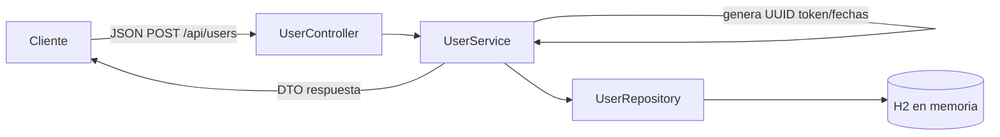

<<<<<<< HEAD
# ApiRestFull-Users

API RESTful para registrar usuarios con validaciones configurables. Usa Spring Boot 3, Java 21, JPA/Hibernate y base de datos en memoria H2.

## Requisitos
- Java 21
- Gradle 8.x (`gradle` instalado). El wrapper no se pudo generar en este entorno; si lo prefieres, ejecuta `gradle wrapper` localmente.

## Cómo ejecutar
```bash
gradle bootRun
```

La API queda disponible en `http://localhost:8080`.

## Endpoint
- `POST /api/users`  
  Crea un usuario nuevo.

### Ejemplo de petición
```json
{
  "name": "Juan Rodriguez",
  "email": "juan@rodriguez.org",
  "password": "Hunter2024",
  "phones": [
    {
      "number": "1234567",
      "citycode": "1",
      "contrycode": "57"
    }
  ]
}
```

### Respuesta exitosa (201)
```json
{
  "id": "7dcf4d8c-0a3f-4a40-9495-5b4d3a6f2b20",
  "name": "Juan Rodriguez",
  "email": "juan@rodriguez.org",
  "created": "2024-09-28T10:00:00.123",
  "modified": "2024-09-28T10:00:00.123",
  "last_login": "2024-09-28T10:00:00.123",
  "token": "d3c1f216-23b5-4d4a-9d45-2d66a49d3a30",
  "inactive": false,
  "phones": [
    {
      "number": "1234567",
      "citycode": "1",
      "contrycode": "57"
    }
  ]
}
```

### Errores
Formato estándar: `{"mensaje": "detalle del error"}` con códigos HTTP adecuados (400 validación/formato, 409 correo duplicado).

## Configuración
Valores ajustables en `src/main/resources/application.properties`:
- `user.email.regex`: expresión regular de correo.
- `user.password.regex`: expresión regular de contraseña.

H2 queda en memoria (`jdbc:h2:mem:usersdb`), se crea automáticamente y también hay un script de referencia en `src/main/resources/schema.sql`.

## Diagrama rápido


## Publicación en GitHub
Repositorio: https://github.com/dalcaino7/ApiRestFull-Users
